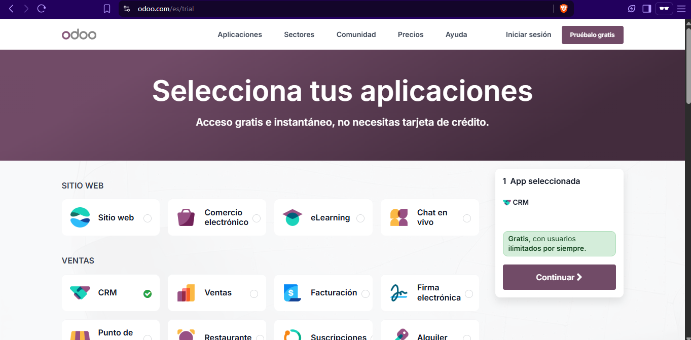
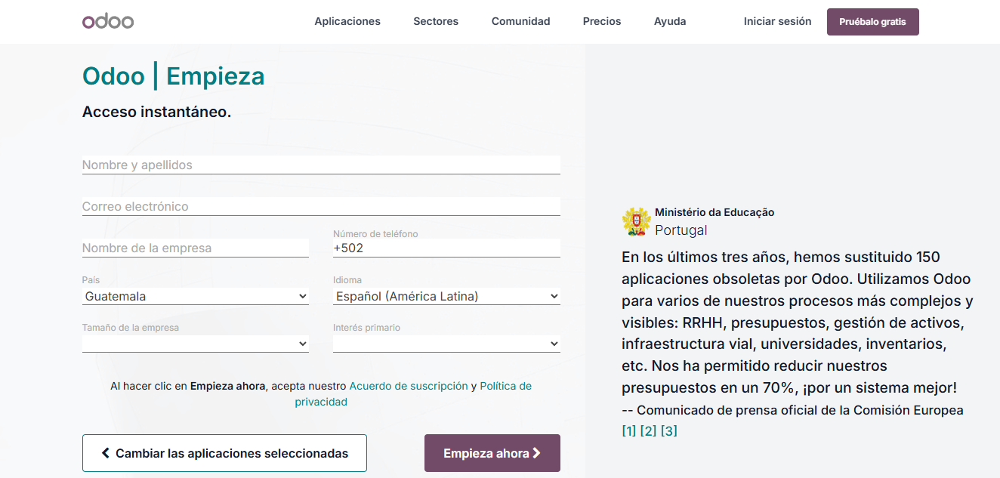
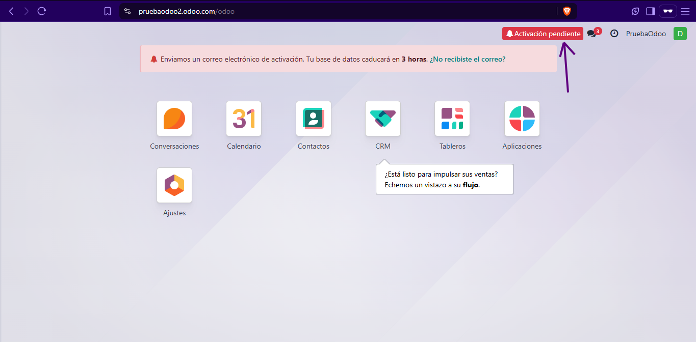
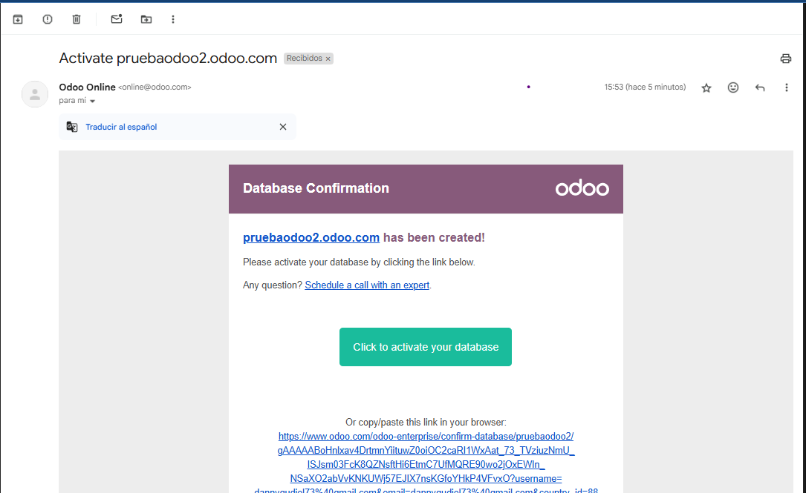
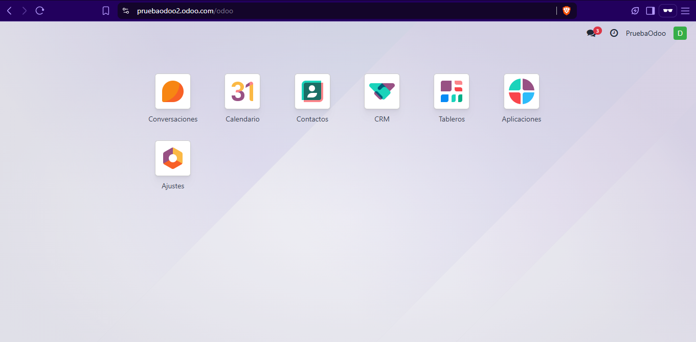
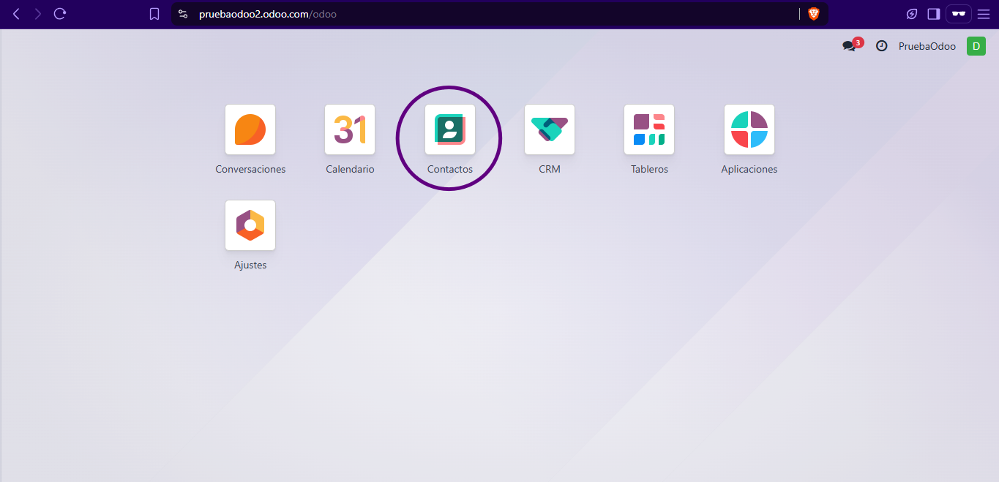
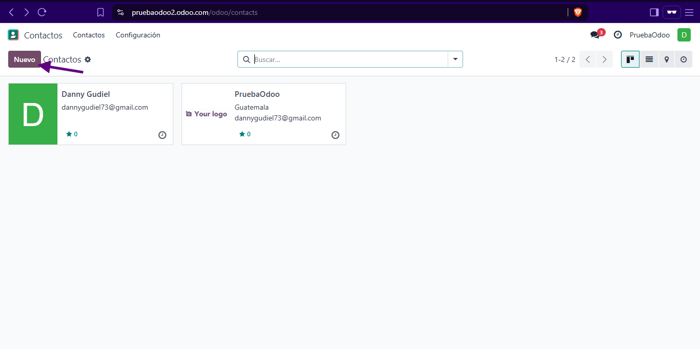
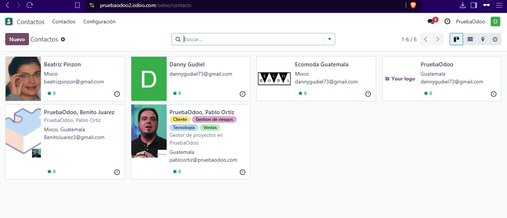

# TestOdoo
## Prueba Odoo Danny Gudiel
### 1. Acceder a Odoo
 1.1 Accede a Odoo dentro de su página web Odoo.com
 

 1.2 Si cuenta con un usuario inicie sesión, de lo contrario registrese gratis con el botón "pruebelo gratis" y selecione la opción de CRM en el apartado de VENTAS.
 

 1.3 Presione el botón de continuar y rellene todos los campos solicitados y presione el botón "Empieza ahora".
 

 1.4 Se iniciará una presentación de bienvenida y el dashboard del CRM. Podrá notar al inicio un aviso de activación de su database, la activación no debe ser mayor de 3 horas. 
 

 1.5 Para ello dirijase a su correo electrónico y en el correo que le envió Odoo presione el botón "Click to activate your database" o bien copiar y pegar el enlace en su navegador.
 

 1.6 Luego de presionar el botón se redirigirá a una nueva pantalla donde debe crear una contraseña con no menos de 12 carácteres. Tras ello, debe actualizar su página que Odoo le asignó y notará no aparecerá la notificación de activación.
 

### 2. Crear contactos
 2.1 Para crear contactos en Odoo es muy sencillo, primero diríjase al apartado de contactos que se encuentra en el dashboard.
 
 
 2.2 Dentro, podrá encontrar todos los contactos tenga, en este caso solo cuenta con el usuario suyo y el de la empresa, para agregar más debera de dirigirse al botón de "Nuevo" en la esquina superior izquierda.
 

 2.3 Luego deberá rellenar los datos de contacto y agregar etiquetas para su fácil localización e incluso puede agregar imagenes. Puede seleccionar si son personas o bien empresas en el apartado de arriba.
 

 2.4 Para agregarlos, Odoo automáticamente agregará los contactos a su listado, con ello ya tendría sus contactos subidos y listos para contactar.
 

#### Dudas o consultas, por favor comunicarse con su Implementador asignado

    Danny Gudiel
    +502 5629-5475
    gudieldanny4@gmail.com

